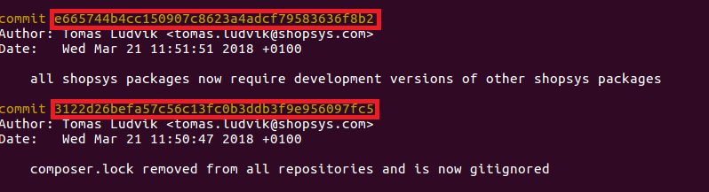

# Guidelines for Pull Request
##  Before pull request
* Fork our [monorepo](https://github.com/shopsys/shopsys)
* Create your branch

```
git branch branch-name
```

* Make desired changes in code and follow [commit message guidelines](./guidelines-for-creating-commits.md)

* Push to your fork

```
git push
```

## 1. Create pull request

* Before creating the PR you have to update the branch on current master:

```
git fetch
git rebase origin/master
```

**Important note:**
If your pull request contains any BC breaks (see [Backward Compatibility Promise](/docs/contributing/backward-compatibility-promise.md)), it should not be targeted against the current master but against a branch where the next major release is being prepared.
E.g., if the latest release is `v7.1.0` and you want to introduce a breaking change, you need to rebase your branch on `8.0` branch and target your PR against it. If no such a branch exists, you need to create one.

* You have to check your change using the command `php phing standards tests tests-acceptance` as it’s mentioned in [contributing](../../project-base/CONTRIBUTING.md).

    *Note: In this step you were using multiple Phing targets.
    More information about what Phing targets are and how they work can be found in [Console Commands for Application Management (Phing Targets)](/docs/introduction/console-commands-for-application-management-phing-targets.md)*

* Please make sure you sign form to agree with the [license agreement](https://www.shopsys-framework.com/license-agreement).
* [Create a PR](https://github.com/shopsys/shopsys/compare?expand=1) with essential information to make our code review easier.
    * you do not have to update `CHANGELOG.md` at all as it is generated automatically using [symplify/changelog-linker](https://github.com/symplify/changeloglinker) during our release process.
* Now just wait for review of your change.

## 2. Changes after review
During the review, reviewer will write comments how to improve the solution or fix bugs. CR can end in `Approved` or `RequestChanges` status when further edits are needed. After completing the CR, it is necessary to correct to correct errors encountered by the reviewer.
It would be good if you could respond to each comment so that we knew you were reading them.
We use fixup commits for correcting pull request so the reviewer can see what edits were made. Once the changes are done, the branch must be pushed. Comments to commit message should be corrected after the fixup commit squash.

#### Fixup commit usage:
* Changes which you want to add to previous commits commit independently with ```git commit --fixup=hash```. Commit messages will be automatically completed.  

#### Hash commit on GitHub (in right):


#### Hash in console command git log:



## 3. Approved
If the reviewer is satisfied with changes, squash fixup commits.
* Update the branch on current master:

```
git fetch
git rebase origin/master
```

* Squash fixup commits:

```
git rebase --interactive --autosquash origin/master
```
After squash you just need to correct commit messages (if needed) and push it:

```
git push --force
```

##### Wait for the merge from SSFW developers and look forward for better Shopsys Framework.
