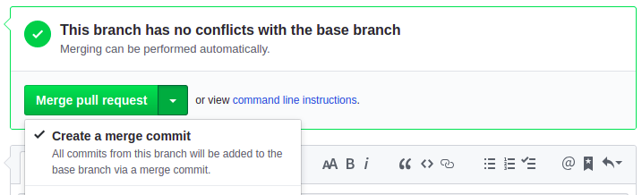

# Merging to Master on Github

We use several different approaches to merging commits into master. This article describes when to use which approach.
All the scenarios presume that there are no conflicts with the base branch (i.e. with `master`). Otherwise, you have to resolve the conflicts locally.

**Scenario 1: I have only one commit in my branch and I want to merge it into `master` branch.**
- I can use the "Squash and merge" button on PR detail.


**Scenario 2: I have multiple commits in my branch but I want to discard them and merge all the changes as one commit into `master` (i.e. I do not want to keep the history of my commits).**
- same as scenario 1, I can use "Squash and merge".

**Scenario 3: I have multiple commits in my branch and I want to merge them all into `master` using merge commit (i.e. I want to keep the history of my commits).**
- When my branch is rebased on current `master`, I can use the "Merge pull request" button on PR detail (i.e. "Create a merge commit" option).
I have to add some suitable commit message that summarizes the whole modification and include the PR number in parentheses (e.g. `release of version 7.0.0-beta1 (#485)`).



- When my branch is not rebased on current master, I need to manually rebase and push-force it so I can use the "Merge pull request" button
or I can do the whole merge manually:
```
# checkout my branch that I want to merge
git checkout my-awesome-branch

# fetch changes from remote
git fetch --prune

# rebase my branch onto current remote master
git rebase origin/master

# checkout local master and reset it to remote master  
git checkout master
git merge --ff-only origin/master

# create a merge commit (you need to create a nice merge commit message that contains the PR number in parentheses, e.g. "release of version 7.0.0-beta1 (#485)")
git merge my-awesome-branch --no-ff

# push master
git push
```
