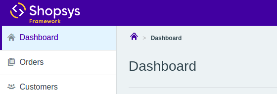
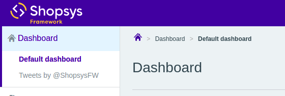

# Adding a New Administration Page

In this cookbook, we will add a new page to the administration, namely a new dashboard page with Twitter updates.
We will see how to create a new admin controller, what template to extend, and how to extend the menu along with the breadcrumb navigation.

## New admin controller

The first step to create a new page is creating a controller (for details, see [Symfony Controller documentation](https://symfony.com/doc/3.4/controller.html)).
Create a class extending `AdminBaseController` in `src/Shopsys/ShopBundle/Controller/Admin` directory with a single method (action):

```php
namespace Shopsys\ShopBundle\Controller\Admin;

use Sensio\Bundle\FrameworkExtraBundle\Configuration\Route;
use Shopsys\FrameworkBundle\Controller\Admin\AdminBaseController;

class DashboardController extends AdminBaseController
{
    /**
     * @Route("/dashboard/ssfw-twitter/")
     */
    public function ssfwTwitterAction()
    {
        return $this->render('@ShopsysShop/Admin/Content/Dashboard/ssfw_twitter.html.twig');
    }
}
```

The `Admin` directory is already configured to use [routing by annotations](https://symfony.com/doc/3.4/routing.html), as it is the easiest to use.
By adding the `@Route("/dashboard/ssfw-twitter/")` annotation, you are creating a route named `admin_dashboard_ssfwtwitter` (`admin_` + lowercase controller name + `_` + lowercase action name).

This newly added route should be available under the URL [http://127.0.0.1:8000/admin/**dashboard/ssfw-twitter/**](http://127.0.0.1:8000/admin/dashboard/ssfw-twitter/) by default.
If you try to access the page, it will fail on loading non-existing template, which we will fix in the next step.

If you'd like to create something more complicated, you can require other services in the controller's constructor, which will be autowired.

## Twig template

Create a new Twig template named `ssfw_twitter.html.twig` in `src/Shopsys/ShopBundle/Resources/views/Admin/Content` (you'll have to create the directory).

The template should extend `@ShopsysFramework/Admin/Layout/layoutWithPanel.html.twig` and extend its blocks `title`, `h1` and `block main_content`:

```twig


- {{ 'Tweets by @ShopsysFW'|trans }}
{{ 'Updates from the Shopsys Framework'|trans }}


    <a class="twitter-timeline" data-lang="{{ app.request.locale }}" data-theme="light" href="https://twitter.com/ShopsysFW"></a>
    <script async src="https://platform.twitter.com/widgets.js" charset="utf-8"></script>

```

The content of the page is just a simple [Twitter widget](https://publish.twitter.com/) but you can put any content in your page.
You can use the controller to pass some parameters to your template.
Feel free to examine other controllers for inspiration.

If you're new to Twig, you can take a look at [Symfony Templating documentation](http://symfony.com/doc/current/templating.html).

Now the page should load correctly and display the newest tweets of [@ShopsysFW](https://twitter.com/ShopsysFW).
But to access it, you still need to open a specific URL...

## Side menu and breadcrumbs
The admin side menu is implemented by [KnpMenuBundle](https://symfony.com/doc/master/bundles/KnpMenuBundle/index.html) and to extend it, you can use [events](https://symfony.com/doc/master/bundles/KnpMenuBundle/events.html).
For the details about the customization of the menu, read the [Administration Menu](/docs/administration/administration-menu.md) article.

Right now, the Dashboard menu looks like this:



Create a new [event subscriber](https://symfony.com/doc/current/event_dispatcher.html) and subscribe to the `ConfigureMenuEvent::SIDE_MENU_DASHBOARD` event.
This is an event that will allow you to reconfigure the Dashboard menu and add a new item there.
You can take a look at the class [`ConfigureMenuEvent`](/packages/framework/src/Model/AdminNavigation/ConfigureMenuEvent.php) to see other events you can subscribe to.

You can put the subscriber right beside your new controller.

In the subscriber, you should add a new child to the menu with the route of your new page.
As the Dashboard menu currently has no children, you can remove the link and add a new child with the original dashboard, so it's still accessible:

```php
namespace Shopsys\ShopBundle\Controller\Admin;

use Knp\Menu\ItemInterface;
use Shopsys\FrameworkBundle\Model\AdminNavigation\ConfigureMenuEvent;
use Symfony\Component\EventDispatcher\EventSubscriberInterface;

class SideMenuConfigurationSubscriber implements EventSubscriberInterface
{
    public static function getSubscribedEvents(): array
    {
        return [ConfigureMenuEvent::SIDE_MENU_DASHBOARD => 'configureDashboardMenu'];
    }

    public function configureDashboardMenu(ConfigureMenuEvent $event): void
    {
        $dashboardMenu = $event->getMenu();

        $dashboardMenu->addChild('default', ['route' => 'admin_default_dashboard', 'label' => t('Default dashboard')]);
        $dashboardMenu->addChild('ssfw_twitter', ['route' => 'admin_dashboard_ssfwtwitter', 'label' => t('Tweets by @ShopsysFW')]);

        $this->removeLink($dashboardMenu);
    }

    private function removeLink(ItemInterface $item): void
    {
        $item->setExtra('routes', []);
        $item->setUri(null);
    }
}
```

The event subscriber should be auto-discovered by Symfony, reconfiguring the menu and resulting in this structure:



## Conclusion

We've seen how to add a new simple page into the administration with a route and its own place in the side menu.
A similar approach could be used to add more complicated parametrized pages using other services or forms.

Also, we've not only added a new item to the menu, but we've modified some parameters of an already existing menu item, removing the link from it.
This can be used for altering the menu in a more significant way.

To see how the side menu works, you can see the [`SideMenuBuilder`](/packages/framework/src/Model/AdminNavigation/SideMenuBuilder.php) class where it is created.
