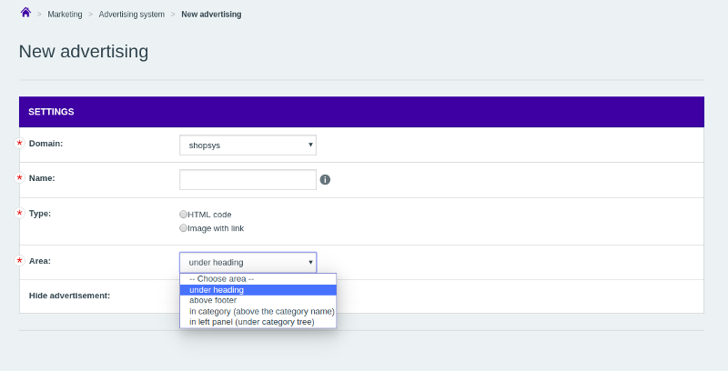

# Adding a New Advert Position

By default, you can place an advert banner on these predefined positions:
- under the page header
- in the left panel (under the category tree)
- above the page footer
- in a category detail (above the category name)

All the positions are defined in `AdvertPositionRegistry` class that provides them for displaying on the adverts list in admin as well as for the options in the selectbox on the advert detail administration page:



If you want to add a new custom position, let us say on the product detail page, you need to follow these steps:

1. Create a new class that extends `AdvertPositionRegistry` and override `getAllLabelsIndexedByNames()` method where you add a translated description for your new advert position to the existing ones.
    ```php
    <?php
    
    namespace Shopsys\ShopBundle\Model\Advert;
    
    use Shopsys\FrameworkBundle\Model\Advert\AdvertPositionRegistry as BaseAdvertPositionRegistry;
    
    class AdvertPositionRegistry extends BaseAdvertPositionRegistry
    {
        /**
         * @return string[]
         */
        public function getAllLabelsIndexedByNames(): array
        {
            $advertPositions = parent::getAllLabelsIndexedByNames();
            $advertPositions['productDetail'] = t('on product detail page');
            
            return $advertPositions;
        }
    }
    ```

2. In your `services.yml`, set your new class as an alias for the base one.
    ```yaml
    Shopsys\FrameworkBundle\Model\Advert\AdvertPositionRegistry: 
        class: Shopsys\ShopBundle\Model\Advert\AdvertPositionRegistry
    ```

3. Render the new advert on the product detail page (or wherever else you want) by adding the following line into the corresponding twig template.
    ```twig
    {{ render(controller('ShopsysShopBundle:Front/Advert:box',{'positionName' : 'productDetail'})) }}
    ```
    If you misspell the position name (or otherwise use a non-registered one) an exception will be thrown including the list of all registered positions.
    So don't worry about calling the controller in a wrong way.

4. Add new entry into `noticer` section in `src/Shopsys/ShopBundle/Resources/config/images.yml` config if you want to provide additional information about the new position for the images overview admin page (`Settings > Image size > Image size` on URL `admin/image/overview/`)
    ```yaml
    -   name: noticer
        class: Shopsys\FrameworkBundle\Model\Advert\Advert
        sizes:
            -   name: productDetail
                width: 1160
                height: ~
                crop: false
                occurrence: 'Front-end: Product detail'
    ```

## Conclusion

An administrator can now pick the newly created position when creating an ad in the *Marketing > Advertising system* section.
The advert will then display on the page we edited in the third step (eg. the product detail page).
This allows quick customization of the online store visuals via the administration.

Adding further advert positions will be even simpler as you only add a new item in your already existing implementation of `AdvertPositionRegistry`.
