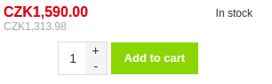
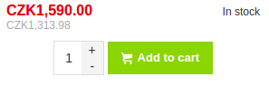

# Adding an Icon into a Button

When designing your custom online store based on Shopsys Framework, you might want to add an icon to some submit buttons on front-end.
This is achievable very easily by using special CSS classes.
Let us demonstrate it on "Add to cart button".



1. Open the corresponding twig template - `@ShopsysShop/Front/Inline/Cart/productAction.html.twig`
2. Find the line where the submit button is rendered and add 3 CSS classes:
    - `btn--with-icon`
    - `btn--with-icon--right` if you want to display the icon after the label or `btn--with-icon--left` if you want to display the icon before the label
    - `svg-iconname` (svg icons are generated by Grunt, list of supported icons can be found in `docs/generated/webfont-front-svg.html` in your project)  

```twig
{{ form_widget(form.add, {label: 'Add to cart'|trans, attr: {class: 'btn--success btn--with-icon btn--with-icon--left svg-cart'}}) }}
```

