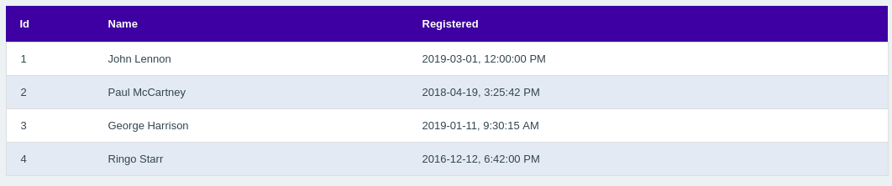
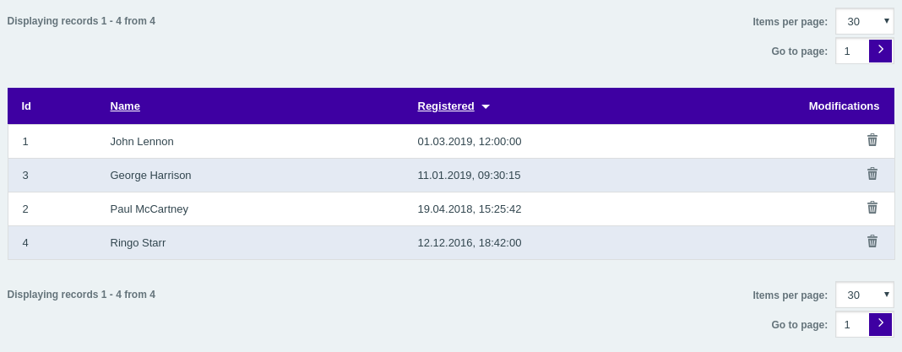

# Create Basic Grid
In this cookbook, we will create a new grid to display salesmen data in the administration.
We will learn how to properly use grid factory, how to configure data displayed, and override the default data presentation.
In the end, we will be able to even sort our grid by column, paginate large result sets and delete records.

## Prerequisites
* As we are going to list the salesmen, you need to create the Salesman entity and add some entries to the database table following [the cookbook](/docs/cookbook/adding-a-new-entity.md), first.
* You should know how to work with controllers, its actions and be familiar with concepts of administration pages in Shopsys Framework.
    * We recommend you to read [Adding a New Administration Page](/docs/cookbook/adding-a-new-administration-page.md) cookbook.

## 1. Define the grid
### 1.1 Create grid factory
First, we need to create a factory responsible for the creation of our new grid.

In `Shopsys\ShopBundle\Grid\Salesman` namespace we create the new class that will implement `GridFactoryInterface`.
This interface forces us to implement `SalesmanGridFactory::create` method responsible for creating the grid itself.

General class `GridFactory` helps us with preparation of the grid, so we will request this service in the constructor.

```php
declare(strict_types=1);

namespace Shopsys\ShopBundle\Grid\Salesman;

use Shopsys\FrameworkBundle\Component\Grid\Grid;
use Shopsys\FrameworkBundle\Component\Grid\GridFactory;
use Shopsys\FrameworkBundle\Component\Grid\GridFactoryInterface;

class SalesmanGridFactory implements GridFactoryInterface
{
    /**
     * @var \Shopsys\FrameworkBundle\Component\Grid\GridFactory
     */
    protected $gridFactory;

    /**
     * @param \Shopsys\FrameworkBundle\Component\Grid\GridFactory $gridFactory
     */
    public function __construct(GridFactory $gridFactory)
    {
        $this->gridFactory = $gridFactory;
    }

    /**
     * @return \Shopsys\FrameworkBundle\Component\Grid\Grid
     */
    public function create(): Grid
    {
        /* @TODO: implement */
    }
}
```

In `services.yml`, we need to register this new class.
```yaml
    Shopsys\ShopBundle\Grid\Salesman\SalesmanGridFactory: ~
```

### 1.2 Configure grid data source
`GridFactory::create()` requires an implementation of `DataSourceInterface` as its second argument.
So we create one that returns all salesmen we need.

In our `SalesmanGridFactory`, we add a new protected method, that creates and returns data source.
And because we want to get data from the database, we use data source created from Doctrine Query Builder.

```diff
+ use Doctrine\ORM\EntityManagerInterface;

+   /**
+    * @var \Doctrine\ORM\EntityManagerInterface
+    */
+   protected $entityManager;

-   public function __construct(GridFactory $gridFactory)
+   public function __construct(GridFactory $gridFactory, EntityManagerInterface $entityManager)
    {
        $this->gridFactory = $gridFactory;
+       $this->entityManager = $entityManager;
    }

    /**
     * @return \Shopsys\FrameworkBundle\Component\Grid\Grid
     */
    public function create(): Grid
    {
-       /* @TODO: implement */
+       $grid = $this->gridFactory->create('salesmanGrid', $this->createAndGetDataSource());

+       return $grid;
    }
```

Now, let's implement `createAndGetDataSource` method that should be in the same `SalesmanGridFactory` and will look like this.
```php
use Shopsys\FrameworkBundle\Component\Grid\DataSourceInterface;
use Shopsys\FrameworkBundle\Component\Grid\QueryBuilderDataSource;
use Shopsys\ShopBundle\Model\Salesman\Salesman;

...

    /**
     * @return \Shopsys\FrameworkBundle\Component\Grid\DataSourceInterface
     */
    protected function createAndGetDataSource(): DataSourceInterface
    {
        $queryBuilder = $this->entityManager->createQueryBuilder();

        $queryBuilder->select('s')
            ->from(Salesman::class, 's');

        return new QueryBuilderDataSource($queryBuilder, 's.id');
    }
```

Do not forget to add import of `Shopsys\ShopBundle\Model\Salesman\Salesman` to `SalesmanGridFactory`.

### 1.3 Add columns to the grid
We prepared our grid, but for now, it is not rendered anywhere and does not contain any columns.
We are going to change this now.

First, we add columns we want to see into `SalesmanGridFactory::create` method.

```diff
    public function create(): Grid
    {
        $grid = $this->gridFactory->create('salesmanGrid', $this->createAndGetDataSource());

+       $grid->addColumn('id', 's.id', t('Id'));
+       $grid->addColumn('name', 's.name', t('Name'));
+       $grid->addColumn('registeredAt', 's.registeredAt', t('Registered'));

        return $grid;
    }
```

*Note: In the example above, the column names are translated. Do not forget to [dump translations](/docs/introduction/console-commands-for-application-management-phing-targets.md#dump-translations).*

## 2. Display the grid

Grid is ready to show all the salesmen from the database.
And we just need to render grid itself using a controller.

### 2.1 Create a new controller & action
We need to inject (pass through constructor) `SalesmanGridFactory` created earlier and pass grid view to the template.
```php
namespace Shopsys\ShopBundle\Controller\Admin;

use Sensio\Bundle\FrameworkExtraBundle\Configuration\Route;
use Shopsys\FrameworkBundle\Controller\Admin\AdminBaseController;
use Shopsys\ShopBundle\Grid\Salesman\SalesmanGridFactory;

class SalesmanController extends AdminBaseController
{
    /**
     * @var \Shopsys\ShopBundle\Grid\Salesman\SalesmanGridFactory
     */
    protected $salesmanGridFactory;

    /**
     * @param \Shopsys\ShopBundle\Grid\Salesman\SalesmanGridFactory $salesmanGridFactory
     */
    public function __construct(SalesmanGridFactory $salesmanGridFactory)
    {
        $this->salesmanGridFactory = $salesmanGridFactory;
    }

    /**
     * @Route("/salesman/list/")
     */
    public function listAction()
    {
        $grid = $this->salesmanGridFactory->create();

        return $this->render('@ShopsysShop/Admin/Content/Salesman/list.html.twig', [
            'gridView' => $grid->createView(),
        ]);
    }
}
```

### 2.2 Create a new template
Finally, it is time to create a new twig template, `src/Shopsys/ShopBundle/Resources/views/Admin/Content/Salesman/list.html.twig` with the following content:
```twig


- {{ 'Salesmen'|trans }}
{{ 'Salesmen'|trans }}


    {{ gridView.render() }}

```

Now, you should be able to see the basic grid with salesmen data when accessing `/admin/salesman/list/`


*Note: If you want to add a link to the page to the menu and proper breadcrumb navigation,
please check the corresponding section in [Adding a New Administration Page](/docs/cookbook/adding-a-new-administration-page.md#side-menu-and-breadcrumbs) cookbook.*

## 3. Modify the basic grid appearance
As you probably noticed, dates in the third column are not printed much friendly.
To adjust appearance (e.g., let's say we are in Germany and want to format the dates appropriately) we just need to extend the default grid template and modify it accordingly.

### 3.1 Create a new template
We create the new twig template `listGrid.html.twig` in `src/Shopsys/ShopBundle/Resources/views/Admin/Content/Salesman`.
The template has to extend `@ShopsysFramework/Admin/Grid/Grid.html.twig` and override block `grid_value_cell_id_registeredAt` where we apply a Twig filter to the value.
[You can read more about blocks here](/docs/administration/grid-rendering-customization.md).

```twig



    {{ value|formatDateTime('de') }}

```

### 3.2 Set the grid theme
Now that we have template ready, we just need to set it as the theme in grid factory.

```diff
// src/Shopsys/ShopBundle/Grid/Salesman/SalesmanGridFactory

    public function create(): Grid
    {
        $grid = $this->gridFactory->create('salesmanGrid', $this->createAndGetDataSource());

        ...

+       $grid->setTheme('@ShopsysShop/Admin/Content/Salesman/listGrid.html.twig');

        return $grid;
    }
```

## 4. Sort rows
Now we see data as we want, but it would be nice to be able to adjust the view from the users perspective.
We may want to ease finding of a certain salesman by allowing to sort rows by name or date of creation.

A default order will be by date with newest salesmen at the top.

```diff
// src/Shopsys/ShopBundle/Grid/Salesman/SalesmanGridFactory

    public function create(): Grid
    {
        $grid = $this->gridFactory->create('salesmanGrid', $this->createAndGetDataSource());

        $grid->addColumn('id', 's.id', t('Id'));
-       $grid->addColumn('name', 's.name', t('Title'));
+       $grid->addColumn('name', 's.name', t('Title'), true);
-       $grid->addColumn('registeredAt', 's.registeredAt', t('Registered'));
+       $grid->addColumn('registeredAt', 's.registeredAt', t('Registered'), true);

+       $grid->setDefaultOrder('registeredAt', DataSourceInterface::ORDER_DESC);

        ...
   }
```

## 5. Paginate results
As the number of salesmen grow, the clarity decreases rapidly.
To keep work with grid enjoyable, we can split data across several pages with pagination.

In the grid is just a matter of calling one method.

```diff
// src/Shopsys/ShopBundle/Grid/Salesman/SalesmanGridFactory

    public function create(): Grid
    {
        $grid = $this->gridFactory->create('salesmanGrid', $this->createAndGetDataSource());
        ...

+       $grid->enablePaging();

        ...
     }
```

## 6. Delete salesmen using the grid
As the last, an admin may want to delete some salesmen.
Grid eases the task with already implemented action column.

### 6.1 Implement the deletion logic
First, we need to get the salesman entity by its id and then remove it from persistence using Doctrine entity manager.
We will follow the basic concepts of Shopsys Framework (see ["Basics about model architecture"](/docs/introduction/basics-about-model-architecture.md) article) and create new classes - `SalesmanFacade` and `SalesmanRepository`.

#### 6.1.1 Create `SalesmanRepository` and implement `getById` method
 ```php
 // src\Shopsys\ShopBundle\Model\Salesman\SalesmanRepository.php
declare(strict_types=1);

namespace Shopsys\ShopBundle\Model\Salesman;

use Doctrine\ORM\EntityManagerInterface;
use Doctrine\ORM\EntityRepository;

class SalesmanRepository
{
    /**
     * @var \Doctrine\ORM\EntityManagerInterface
     */
    protected $em;

    /**
     * @param \Doctrine\ORM\EntityManagerInterface $em
     */
    public function __construct(EntityManagerInterface $em)
    {
        $this->em = $em;
    }

    /**
     * @param int $salesmanId
     * @return \Shopsys\ShopBundle\Model\Salesman\Salesman
     */
    public function getById(int $salesmanId): Salesman
    {
        $salesman = $this->getSalesmanRepository()->find($salesmanId);

        if ($salesman === null) {
            // you should throw new custom exception here...
        }

        return $salesman;
    }

    /**
     * @return \Doctrine\ORM\EntityRepository
     */
    protected function getSalesmanRepository(): EntityRepository
    {
        return $this->em->getRepository(Salesman::class);
    }
}
```

#### 6.1.2 Create `SalesmanFacade` and implement `deleteById` method
```php
// src\Shopsys\ShopBundle\Model\Salesman\SalesmanFacade.php
declare(strict_types=1);

namespace Shopsys\ShopBundle\Model\Salesman;

use Doctrine\ORM\EntityManagerInterface;

class SalesmanFacade
{
    /**
     * @var \Doctrine\ORM\EntityManagerInterface
     */
    protected $entityManager;

    /**
     * @var \Shopsys\ShopBundle\Model\Salesman\SalesmanRepository
     */
    protected $salesmanRepository;

    /**
     * @param \Doctrine\ORM\EntityManagerInterface $entityManager
     * @param \Shopsys\ShopBundle\Model\Salesman\SalesmanRepository $salesmanRepository
     */
    public function __construct(EntityManagerInterface $entityManager, SalesmanRepository $salesmanRepository)
    {
        $this->entityManager = $entityManager;
        $this->salesmanRepository = $salesmanRepository;
    }

    /**
     * @param int $salesmanId
     */
    public function deleteById(int $salesmanId)
    {
        $salesman = $this->salesmanRepository->getById($salesmanId);

        $this->entityManager->remove($salesman);
        $this->entityManager->flush();
    }
}
```

### 6.2 Add delete action to the controller
In our `SalesmanController`, we add the new action to delete the salesman using `SalesmanFacade`.
```diff
// src/Shopsys/ShopBundle/Controller/Admin/SalesmanController
namespace Shopsys\ShopBundle\Controller\Admin;

use Sensio\Bundle\FrameworkExtraBundle\Configuration\Route;
+ use Shopsys\FrameworkBundle\Component\Router\Security\Annotation\CsrfProtection;
use Shopsys\FrameworkBundle\Controller\Admin\AdminBaseController;
use Shopsys\ShopBundle\Grid\Salesman\SalesmanGridFactory;
+ use Shopsys\ShopBundle\Model\Salesman\SalesmanFacade;

class SalesmanController extends AdminBaseController
{
+    /**
+     * @var \Shopsys\ShopBundle\Model\Salesman\SalesmanFacade
+     */
+    protected $salesmanFacade;

-    public function __construct(SalesmanGridFactory $salesmanGridFactory)
+    public function __construct(SalesmanGridFactory $salesmanGridFactory, SalesmanFacade $salesmanFacade)
     {
         $this->salesmanGridFactory = $salesmanGridFactory;
+        $this->salesmanFacade = $salesmanFacade;
+    }

+    /**
+     * @Route("/salesman/delete/{id}", requirements={"id" = "\d+"})
+     * @CsrfProtection
+     */
+    public function deleteAction($id)
+    {
+        $this->salesmanFacade->deleteById($id);
+
+        $this->getFlashMessageSender()
+            ->addInfoFlash(t('Salesman with id %id% deleted', ['%id%' => $id]));
+
+        return $this->redirectToRoute('admin_salesman_list');
+    }
```

*Note: It is a good practice to enable [CSRF protection](https://www.owasp.org/index.php/Cross-Site_Request_Forgery_(CSRF)) on this type of actions.*

### 6.3 Add action column to the grid
We just use `addDeleteActionColumn` in existing `SalesmanGridFactory` with arguments `admin_salesman_delete` as a route  and request parameters (action have to know id of the salesman to delete).
To prevent accidental deletion we can also set a confirmation message.
```diff
// src/Shopsys/ShopBundle/Grid/Salesman/SalesmanGridFactory

    public function create(): Grid
    {
        $grid = $this->gridFactory->create('salesmanGrid', $this->createAndGetDataSource());

        $grid->addColumn('id', 's.id', t('Id'));
        $grid->addColumn('name', 's.name', t('Title'));
        $grid->addColumn('registeredAt', 's.registeredAt', t('Registered'));

+       $grid->addDeleteActionColumn('admin_salesman_delete', ['id' => 's.id'])
+           ->setConfirmMessage(t('Do you really want to remove this salesman?'));
    ...
```

## Conclusion
Now you should be able to create a new grid and to use the strengths of the grid component to display, sort and delete salesmen.
A similar approach could be used to create a grid that precisely presents any data in a way you need.


