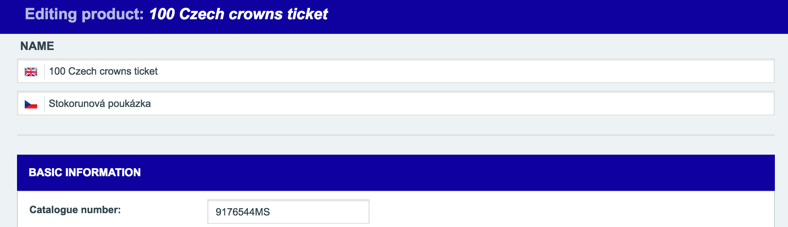

# Modifying a Template in Administration

In this tutorial, we'll show you how to proceed if you need to modify a twig template in the administration.
We will demonstrate this procedure with the example "How to display a product transfer status on the product detail page in the administration".

## Adding the information into the template

This tutorial assumes that the product already contains the transfer status attribute.
If you need to extend the product with a new attribute, see the tutorial [Adding new attribute to an entity](./adding-new-attribute-to-an-entity.md).

Modifying the bundle templates that are located in the vendor can be done via overriding these templates.

*If you need to extend or modify the form itself, it is not necessary to use the overriding and consequently to lose an upgradeability.
For the extensions of the forms, see [Enable administrator to edit the `extId` field](./adding-new-attribute-to-an-entity.md#enable-administrator-to-edit-the-extId-field).*

1. The first step is to create a copy of the original twig template that you want to modify.
    Because you are trying to override the template located in
    ```
    vendor/shopsys/framework/src/Resources/views/Admin/Content/Product/detail.html.twig
    ```
    therefore, the copy must be located in
    ```
    app/Resources/ShopsysFrameworkBundle/views/Admin/Content/Product/detail.html.twig
    ```
    See especially the new directory `ShopsysFrameworkBundle` whose title is based on the name of the bundle with original template.
    Thanks to this exact location, your new copy of the template will be used instead of the original template from the FrameworkBundle during the rendering process.
    At this point, you just need to modify your copy of the template in such a way that product transfer status will be displayed on the page.

2. The second step is the modification of the copy itself

    The template before the modification:
    
    ```
        ...
        
        
        
        
        
        
            
                
            
                
            
        
            {{ form_start(form) }}
                {{ form_errors(form) }}
        
                
                    
                        <button id="js-close-without-saving" type="button" class="btn-link-style">{{ 'Close without saving'|trans }}</button>
                        {{ form_save(product|default(null), form) }}
                    
                
        
            {{ form_end(form) }}
        
        
        ...
    ```
    
    View in the administration before the modification:
    
    

    Now, add the simple condition, wrapped into the divs for a prettier look, into `app/Resources/ShopsysFrameworkBundle/views/Admin/Content/Product/detail.html.twig` to display the product transfer status

    ``` 
        <div class="form-line">
            <div class="form-line__line form-line__line--no-space">
                <div class="form-line__item form-line__item--text">
                
                    
                        {{ 'Product is already transferred into IS.'|trans }}
                    
                        {{ 'Product is not yet transferred into IS.'|trans }}
                    
                    
                </div>
            </div>
        </div>
    ```

    The template after the modification:
    
    ```
        ...
        
        
        
        
        
        
            
                
            
                
            
        
            <div class="form-line">
                <div class="form-line__line form-line__line--no-space">
                    <div class="form-line__item form-line__item--text">
                        
                            {{ 'Product is already transferred into IS.'|trans }}
                        
                            {{ 'Product is not yet transferred into IS.'|trans }}
                        
                    </div>
                </div>
            </div>
            
            {{ form_start(form) }}
                {{ form_errors(form) }}
        
                
                    
                        <button id="js-close-without-saving" type="button" class="btn-link-style">{{ 'Close without saving'|trans }}</button>
                        {{ form_save(product|default(null), form) }}
                    
                
        
            {{ form_end(form) }}
        
        
        ...
    ```
    
    View in the administration after the modification:
    
    

## Conclusion
On a practical example, we have shown you how to extend the twig template in the administration.
Using this way of overriding templates, you can edit any Symfony application template, see [How to Override any Part of a Bundle](https://symfony.com/doc/3.4/templating/overriding.html).
