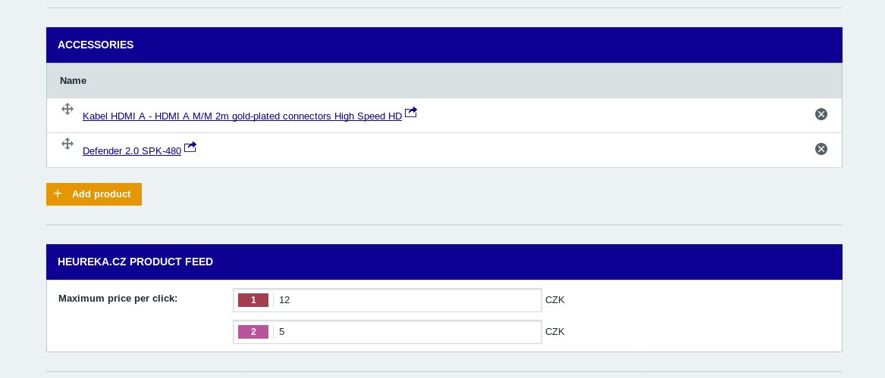

# Extending Form From Plugin
Sometimes your plugin needs some extra information to be included in an entity, for example, you need to track the weight of products.
This can be solved by extending the entity CRUD model with your custom sub-form.

To do so you should implement [`PluginCrudExtensionInterface`](../../packages/plugin-interface/src/PluginCrudExtensionInterface.php) and [tag the service in a DI container](http://symfony.com/doc/current/service_container/tags.html) with `shopsys.crud_extension` tag.
The tag should have a `type` attribute defining which CRUD model should be extended (eg. `"product"`).

Each form extension has its label, form type and methods for managing the form data.

For more information about working with plugins you can see [shopsys/plugin-interface](https://github.com/shopsys/plugin-interface) repository.

## Example
As an example usage we will use `HeurekaProductCrudExtension`.

First you need to add your form type that you want to show in administration. (eg. `product-feed-heureka/src/Form/HeurekaProductFormType.php`)
```php

//...

class HeurekaProductFormType extends AbstractType
{

    //...

    /**
     * @param \Symfony\Component\Form\FormBuilderInterface $builder
     * @param array $options
     */
    public function buildForm(FormBuilderInterface $builder, array $options)
    {
        $builder->add('cpc', MultidomainType::class, [
            'label' => $this->translator->trans('Maximum price per click'),
            'entry_type' => MoneyType::class,
            'required' => false,
            'entry_options' => [
                'currency' => 'CZK',
                'constraints' => [
                    new MoneyRange([
                        'min' => Money::zero(),
                        'max' => Money::create(500),
                    ]),
                ],
            ],
        ]);
    }

    //...

```

Then you need to add the CRUD extension, in our example it's `product-feed-heureka/src/Form/HeurekaProductCrudExtension.php`.
Here you need to add methods for handling data and methods `getFormTypeClass` to set what form should be used and `getFormLabel` so the form can have fitting label.

```php

//...

class HeurekaProductCrudExtension implements PluginCrudExtensionInterface
{

    //...  

    /**
     * @return string
     */
    public function getFormTypeClass()
    {
        return HeurekaProductFormType::class;
    }

    /**
     * @return string
     */
    public function getFormLabel()
    {
        return $this->translator->trans('Heureka.cz product feed');
    }

    /**
     * @param int $productId
     * @return array
     */
    public function getData($productId)
    {
        $heurekaProductDomains = $this->heurekaProductDomainFacade->findByProductId($productId);

        $pluginData = [
            'cpc' => [],
        ];
        foreach ($heurekaProductDomains as $heurekaProductDomain) {
            $pluginData['cpc'][$heurekaProductDomain->getDomainId()] = $heurekaProductDomain->getCpc();
        }
        return $pluginData;
    }

    /**
     * @param int $productId
     * @param array $data
     */
    public function saveData($productId, $data)
    {
        $heurekaProductDomainsData = [];
        if (array_key_exists('cpc', $data)) {
            foreach ($data['cpc'] as $domainId => $cpc) {
                $heurekaProductDomainData = $this->heurekaProductDomainDataFactory->create();
                $heurekaProductDomainData->domainId = $domainId;
                $heurekaProductDomainData->cpc = $cpc;

                $heurekaProductDomainsData[] = $heurekaProductDomainData;
            }
        }
        $this->heurekaProductDomainFacade->saveHeurekaProductDomainsForProductId($productId, $heurekaProductDomainsData);
    }

    /**
     * @param int $productId
     */
    public function removeData($productId)
    {
        $this->heurekaProductDomainFacade->delete($productId);
    }
}

```

Then you need to add configuration to `services.yml` in our example `product-feed-heureka/src/Resources/services.yml`.
```yaml
services:

  #...

    Shopsys\ProductFeed\HeurekaBundle\Form\HeurekaProductCrudExtension:
        tags:
            - { name: shopsys.crud_extension, type: product }
```

And then you should see the sub-form in its place:
