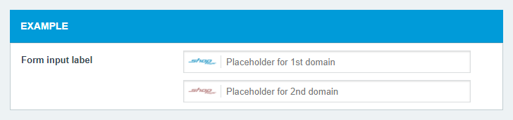
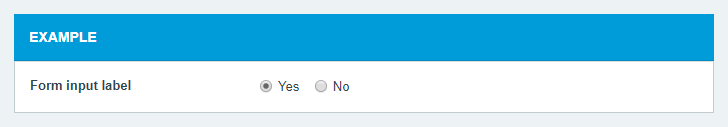

# Shopsys Framework Form Types
Symfony bundle adding form types for usage in [Shopsys Framework](https://www.shopsys-framework.com), its components and plugins.

## Installation
The plugin is a Symfony bundle and is installed in the same way:

### Download
First, you download the package using [Composer](https://getcomposer.org/):
```
composer require shopsys/form-types
```

### Register
For the bundle to be loaded in your application you need to register it in the `app/AppKernel.php` file of your project:
```php
<?php

// ...
class AppKernel extends Kernel
{
    public function registerBundles()
    {
        $bundles = [
            // ...
            new Shopsys\FormTypesBundle\ShopsysFormTypesBundle(),
            // ...
        ];
        
        // ...

        return $bundles;
    }
    
    // ...
}
```

## How to use a custom form type
The form types in this package are regular Symfony form types.
See [Symfony Forms Documentation](https://symfony.com/doc/current/forms.html) for detailed explanation.

## Contents

### [MultidomainType](./src/MultidomainType.php)
Compound type that renders one form of given type for each domain.

It can be configured via the following options:
* `entry_type` - The type of the inner form.
Defaults to `TextType::class`.
* `entry_options` - The options of the inner forms.
Defaults to `[]`.
* `options_by_domain_id` - The options of the inner forms based on the domain ID.
Provide arrays indexed by the domain ID, values are merged with the `entry_options`.
Defaults to `[]`.

The data of the inner forms are returned as an array indexed by the domain ID.



### [YesNoType](./src/YesNoType.php)
Natural looking choice type for boolean value inputs.

It has no notable options.

A boolean value is accepted/returned as data.
A null value can be accepted/returned when no radio button is checked.



## Need help
Contact us on our Slack [http://slack.shopsys-framework.com/](http://slack.shopsys-framework.com/).
