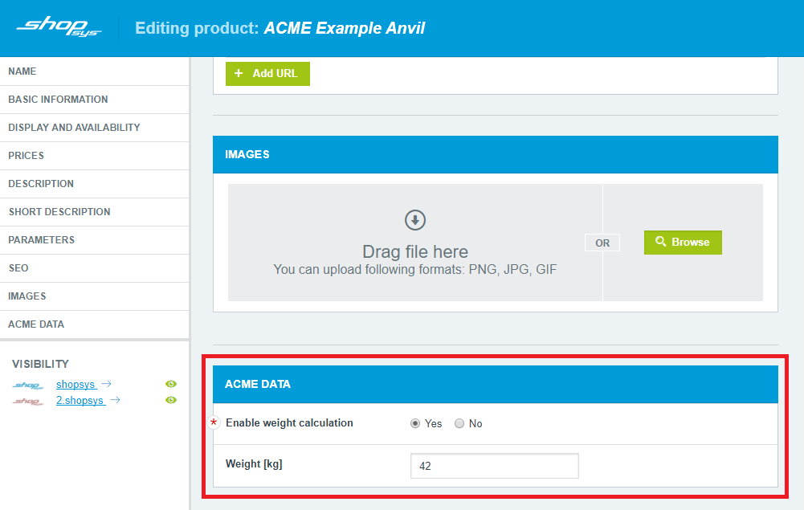

# Shopsys Plugin Interface

[](https://travis-ci.org/shopsys/plugin-interface)
[](https://packagist.org/packages/shopsys/plugin-interface)

Package of interfaces providing compatibility between [Shopsys Framework](https://www.shopsys-framework.com) and plugins.

This repository is maintained by [shopsys/shopsys] monorepo, information about changes is in [monorepo CHANGELOG.md](https://github.com/shopsys/shopsys/blob/master/CHANGELOG.md).

## Features
This package contains interfaces responsible for general functionality usable in almost any plugin.
For specific functionality, such as generating product feeds, there are [separate repositories](https://github.com/search?q=topic%3Aplugin-interface+org%3Ashopsys&type=Repositories).

#### Example
For example usage see the `AcmeProductCrudExtension` in the CRUD extension section below.

### Storing data
Best way to store your plugin data is to use Doctrine entities.
Create a folder (e.g. `src/Entity`) in your plugin and put your entities there.
Then you need to create `DoctrineOrmMappingPass` and add it as `CompilerPass` in your `YourBundleNameBundle` class. This can be done like this:

```php
// vendor/your-bundle-name-bundle/src/YourBundleNameBundle.php

// ...

    /**
     * @inheritdoc
     */
    public function build(ContainerBuilder $container) {
        parent::build($container);

        $container->addCompilerPass(
            DoctrineOrmMappingsPass::createAnnotationMappingDriver(
                [$this->getNamespace() . '\Entity'],
                [$this->getPath() . '/Entity']
            )
        );
    }

// ...

```
This tells Doctrine where to look for your entities. Now you can create `Repository` and manage your data as you are used to.

### CRUD extension
Sometimes your plugin needs some extra information to be included in an entity, for example, you need to track the weight of products.
This can be solved by extending the entity CRUD model with your custom sub-form.

To do so you should implement [`PluginCrudExtensionInterface`](./src/PluginCrudExtensionInterface.php) and [tag the service in a DI container](http://symfony.com/doc/current/service_container/tags.html) with `shopsys.crud_extension` tag.
The tag should have a `type` attribute defining which CRUD model should be extended (eg. `"product"`).

Each form extension has its label, form type and methods for managing the form data.

#### Example
```yaml
services:
  acme.acme_product_crud_extension:
    class: AcmePlugin\AcmeProductCrudExtension
    tags:
      - { name: shopsys.crud_extension, type: product }

  acme.acme_data_form_type:
    class: AcmePlugin\AcmeProductFormType
    tags:
      - { name: form.type }
```

```php
// ...
class AcmeProductCrudExtension implements PluginCrudExtensionInterface
{
    private $acmeProductFacade;

    public function __construct(AcmeProductFacade $acmeProductFacade) {
        $this->acmeProductFacade = $acmeProductFacade;
    }

    public function getFormTypeClass()
    {
        return AcmeProductFormType::class;
    }

    public function getFormLabel()
    {
        return 'ACME data';
    }

    public function getData($productId)
    {
        $acmeProduct = $this->acmeProductFacade->findByProductId($productId);

        $pluginData = [
            'attribute' => $acmeProduct->getAttribute(),
        ];

        return $pluginData;
    }

    public function saveData($productId, $data)
    {
        $acmeProductData = new AcmeProductData();
        $acmeProductData->attribute = $data['attribute'];

        $this->acmeProductFacade->save($productId, $acmeProductData);
    }

    public function removeData($productId)
    {
        $this->acmeProductFacade->remove($productId);
    }
}
```



## Demo Data
In order to enable easy testing or to demonstrate usage of your plugin, you might want to provide demonstrational data with it.
In that case, you should implement [`PluginDataFixtureInterface`](./src/PluginDataFixtureInterface.php) that will take care of loading demonstrational data into the core.

All you got to do is to implement `PluginDataFixtureInterface::load()` method and [tag the service in a DI container](http://symfony.com/doc/current/service_container/tags.html) with `shopsys.data_fixture` tag.

#### Example
```yaml
services:
  acme.acme_bundle.data_fixture:
    class: AcmePlugin\AcmeDataFixture
    tags:
      - { name: shopsys.data_fixture }
```

```php
class AcmeDataFixture implements PluginDataFixtureInterface
{
    private $acmeProductFacade;

    public function __construct(AcmeProductFacade $acmeProductFacade) {
        $this->acmeProductFacade = $acmeProductFacade;
    }

    public function load() {
        $firstAcmeProductData = new AcmeProductData();
        $firstAcmeProductData->enableWeightCalculation = true;
        $firstAcmeProductData->weight = 42;
        $firstAcmeProductData->domainId = 1;

        $this->acmeProductFacade->save($firstAcmeProductData);

        $secondAcmeProductData = new AcmeProductData();
        $secondAcmeProductData->enableWeightCalculation = false;
        $secondAcmeProductData->weight = null;
        $secondAcmeProductData->domainId = 2;

        $this->acmeProductFacade->save($secondAcmeProductData);
    }

}
```

## CRON modules
When your plugin needs to execute some task periodically, for example downloading currency exchange rates every six hours, you can use a CRON module.

There are 2 types of CRON module interfaces:
- [`SimpleCronModuleInterface`](./src/Cron/SimpleCronModuleInterface.php)
  - for short tasks that do not take too long to execute
- [`IteratedCronModuleInterface`](./src/Cron/IteratedCronModuleInterface.php)
  - for long-running tasks that can be divided into smaller parts
  - if the module takes too long to run it will be suspended and will be woken up and re-run during the next opportunity

You can implement either one of these interfaces and [tag the service in a DI container](http://symfony.com/doc/current/service_container/tags.html) with `shopsys.cron` tag.

CRON modules are started automatically every time the current system time matches the specified mask in the tag attributes `hours` and `minutes`.

### Example
```yaml
acme.data_download_cron_module:
    class: AcmePlugin\AcmeDataDownloadCronModule
    tags:
      - { name: shopsys.cron, hours: '*/6', minutes: '0' }
```

```php
// ...
class AcmeDataDownloadCronModule implements SimpleCronModuleInterface
{
    /**
     * @var \Symfony\Bridge\Monolog\Logger
     */
    private $logger;

    public function setLogger(Logger $logger)
    {
        $this->logger = $logger;
    }

    public function run()
    {
        $data = $this->downloadData();
        $this->saveData($data);

        $this->logger->addInfo(sprintf('Downloaded %d new records.', count($data)));
    }

    // ...
}
```

## How to implement a plugin
Plugins are implemented in a form of a [Symfony bundle](http://symfony.com/doc/current/bundles.html).
For tips on how to write a new bundle see [Best Practices for Reusable Bundles](https://symfony.com/doc/current/bundles/best_practices.html).

## Contributing
Thank you for your contributions to Shopsys Plugin Interface package.
Together we are making Shopsys Framework better.

This repository is READ-ONLY.
If you want to [report issues](https://github.com/shopsys/shopsys/issues/new) and/or send [pull requests](https://github.com/shopsys/shopsys/compare),
please use the main [Shopsys repository](https://github.com/shopsys/shopsys).

Please, check our [Contribution Guide](https://github.com/shopsys/shopsys/blob/master/CONTRIBUTING.md) before contributing.

## Support
What to do when you are in troubles or need some help? Best way is to contact us on our Slack [http://slack.shopsys-framework.com/](http://slack.shopsys-framework.com/)

If you want to [report issues](https://github.com/shopsys/shopsys/issues/new), please use the main [Shopsys repository](https://github.com/shopsys/shopsys).

[shopsys/shopsys]:(https://github.com/shopsys/shopsys)
