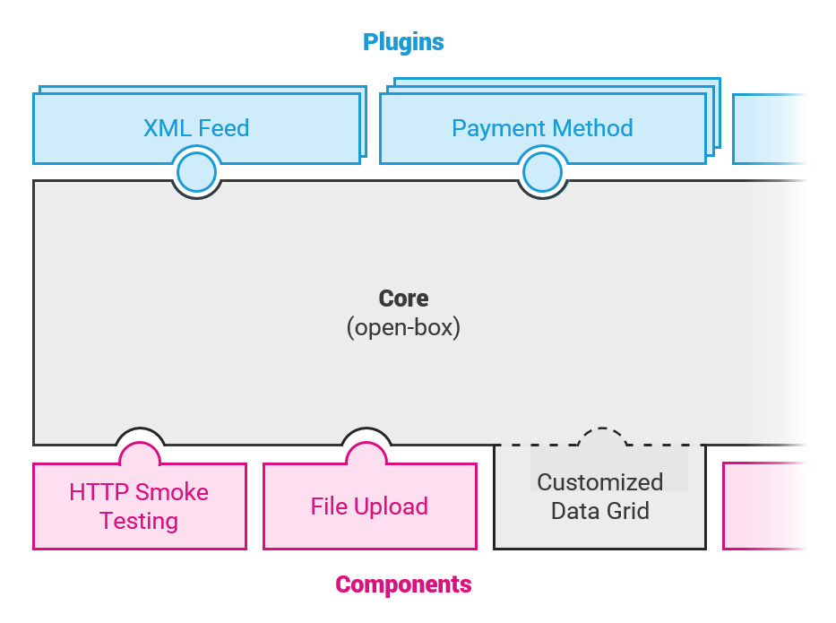

# Basics About Package Architecture

## Introduction
This article describes the architecture of Shopsys Framework from the viewpoint of packages
(in a contrast to application layers, about which you can read in the [separate article](basics-about-model-architecture.md)).
After you finish reading the article, you should be able to understand what are plugins and components and what does it mean
when we say that Shopsys Framework has an open-box core.
You will also know how to start implementing and how to perform upgrades of your own project based on Shopsys Framework.

## Basic terms
In order to make the architecture description understandable, it is necessary to define a few basic terms first.

### Open-box extensibility
The concept enables you to directly change the source code and as a result, permits unrestricted customizability.
We believe that lean codebase that is easily modifiable is a better place to start building your project than a feature-rich platform
with a lot of configurable options.

The core of Shopsys Framework is open-box.
It contains the business logic of a basic online store that you can build on and it is absolutely up to you how you will modify it.

### Glass-box extensibility
Glass-box extensibility does not allow any modifications to the original package code and therefore creates
a clear separation between your code and the code maintained by somebody else (Composer places this code in the vendor directory).

Plugins and components of Shopsys Framework (described below) are designed using glass-box extensibility.

### Plugins
To satisfy the need for an installable functionality, Shopsys Framework provides a plugin system.
Plugins with interfaces are developed in separate packages with [semantic versioning](http://semver.org/).
You can install a plugin just by requiring its package via Composer and registering it in your application.

So far, we extracted product XML feeds (eg. [Google Shopping product feed](https://github.com/shopsys/product-feed-google)) into plugins.
Other candidates for extraction into plugins are for example payment methods gateways, package shipping integrations or analytic service integrations.

For more information about the plugin system capabilities, you can look at the [shopsys/plugin-interface](https://github.com/shopsys/plugin-interface) repository on GitHub.

### Components
In every project, there is a lot of code dedicated to features which are not related to the core of your business,
but you still need it there. And although they are necessary, it can be a long wearisome job building them from the ground up.
Instead, you can use components which are (just like plugins) developed in separate packages with [semantic versioning](http://semver.org/).

The components are isolated from each other -  replacing one of them does not require modifying the others.
So if you want a completely different way of handling the particular task, you can remove the component completely
and implement the required behavior directly in your open-box core repository (eg. customized data grid in the picture below).

One of the first Shopsys Framework components are packages for [HTTP Smoke testing](https://github.com/shopsys/phpstorm-inspect),
[database migrations](https://github.com/shopsys/migrations) or a [CLI tool for running PhpStorm inspections](https://github.com/shopsys/phpstorm-inspect).

*Note: The specific plugins and components in this diagram are just examples.*

## How to develop your project on Shopsys Framework
### Clone or fork?
We recommend cloning Shopsys Framework repository in order to get your own private copy of the framework core to start on.
This is the preferred way because when you clone a repository, you create a local copy of the repository which you can manage as you wish
(eg. using a private instance of GitLab).

*Note: Forking, on the other hand, is creating a copy of the repository on the server side under your GitHub ID.
That means that your copy of the repository would be also public by default which is probably not what you want
(but it is a great way to [make a pull request](https://git.shopsys-framework.com/shopsys/shopsys-framework/blob/master/CONTRIBUTING.md)).*

### Upgrading
We know that upgrading should be as easy as possible, ideally without requiring any modification of your code.
This goal is very hard to achieve while both providing unlimited customizability and innovating the framework itself,
as the project’s every customization has to work well with every new release.

#### Core
So far, there is no automated way of upgrading the core.
You need to [cherry-pick](https://git-scm.com/docs/git-cherry-pick) or [merge](https://git-scm.com/docs/git-merge) modifications from the original repository manually.
We try to ease you the process as much as possible by maintaining clear GIT history,
keeping up-to-date [changelog](/CHANGELOG.md) and [upgrading instructions](/UPGRADE.md),
and writing [understandable commit messages](/docs/contributing/guidelines-for-creating-commits.md).

#### Plugins and components
As mentioned above, plugins and components provide glass-box extensibility,
ie. you can upgrade them independently of the core via `composer update`.

## Conclusion
You have learned that it is necessary to clone Shopsys Framework repository from GitHub when you want to start developing your own project based on the framework.
You also know that it has an open-box core - you can modify the core as you wish without any restrictions and yet you will still be able
to upgrade it by cherry-picking or merging from the original repository thanks to the clean and understandable history.
You know that there are plugins and components to ease you a development of your project and these can be upgraded independently of the core using composer thanks to their glass-box design.
